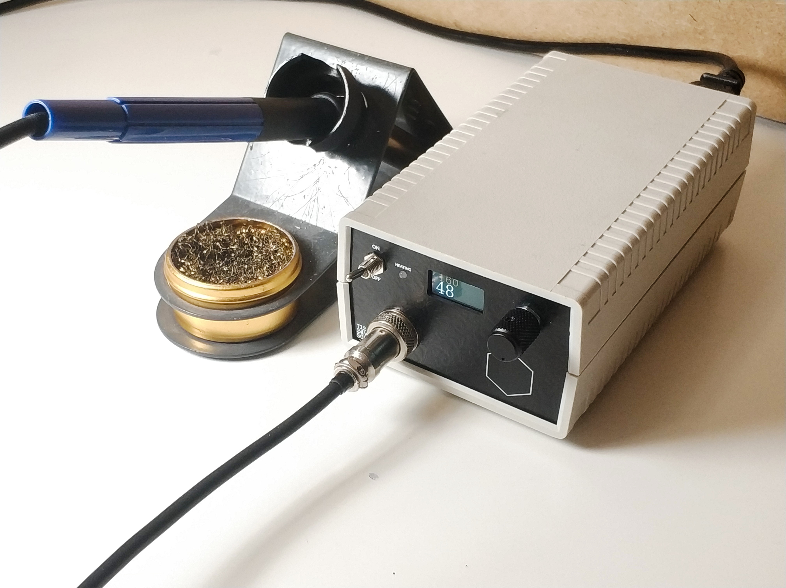
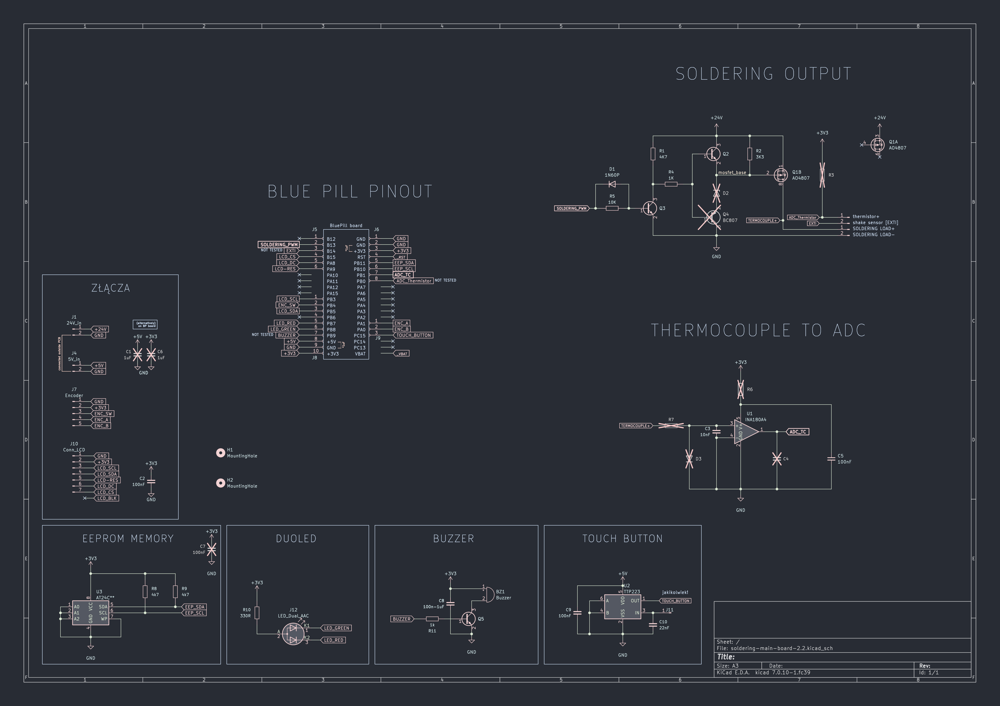
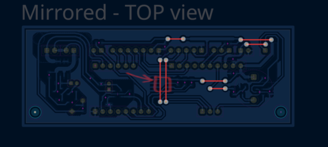

# Soldering station T12

<table>
    <td></td>
    <td></td>
</table>

## Specification:
- **Ramp-up Time**: 5 seconds to achieve 200°C
- **Measurement Accuracy**: up to ±5%
- **Power**: 75W
- **Instability (Consistency) of Set Temperature**: ±0.2°C
- **Temperature Range**: 0 – 500°C (from room temperature)
- **Number of ADC Samples**: 250
- **Measurement Time** / **Percentage of Measurement Duration (Excluding Heating)**: 1.4ms / 1.4% (or 0.9ms / 0.9% for temperatures >150°C)
- **PWM Frequency** / **Measurement Frequency**: 50Hz / 10Hz
- **Other**: (futures below)


<!-- # About my motivation

elektroda. 
*Translated site from polish! -->

### Features:

- T12 Tips Compatibile
- IPS Display
    - Current and Set Temperature in `°C`
    - Power Output Bar Indicator
    - Settings (PID and GUI)
- Rotary Encoder
- Touch Button (stop/start heating)
- Heating LED
- Switch 230VAC 
- Front Panel - PCB made
- Connector GX16 (easy tips replacement)

#### Software Features:

- Efficient Temperature Setting - PID Controller
- Memory - Eeprom
- Autosleep (todo)

## Schematics

<table>
    <tr></tr>
    <tr>
        <td></td>
    </tr>
</table>

## Software requirments

[stlink](https://github.com/stlink-org/stlink?tab=readme-ov-file), kicad (optional)

## Flashing

U need at least STLINK-V2 clone debuger.

``` bash
st-flash --reset write soldering-*.bin 0x08000000
```

If u have error u probably have stm32 clone. Blue-Pill boards have clons of stm32 often. Check `st-info --chipid`. For clones "chipid" is 0 instead 0x0410 or similar. Try my edited config.

``` bash
st-flash -c doc/BP_clone.cfg --reset write soldering-*.bin 0x08000000
```

## Assembly Guide

1. Firstly take a look at BOM and Schematics. Make sure u have all what you need to DIY. Good to check all parts berore u start assembly.
2. If u making PCB by own, remember to:
    - U can use _Ready-to-print.pdf_ for e.g. iron-on method
    - Protect copper by e.g. Rosin
    - Solder wires from "F.cu" layer (may be before drilling, except two connections)
        


    If u order PCB, remember u can also order PCB-front-board together

3. Soldering SMD (**after drilling**) - `InteractiveBOM.html` can help
4. Soldering THT
5. Mount 24V power supply to devices housing and **make separation** between PCB (Plan this housing from mountings things inside)

6. Make power wires from overall schematic for: _Switch, Power suplies, AC connector_ (**Isolate 230V wires and connections**)
7. Make wires and solder from overall schematic for: _Display, Encoder, etc_
6. **Isolate** and Mount (glue) 5V power supply
7. Connect all together, burn binary and **check that's working**
8. Glue OLED on working display (it would be easier to nice match) if u have PCB-front-board.
9. Let's put everything together now

### Additional assembly tips

- **Be careful** with **AC Power**

- required tools:
    - some working soldering iron (it's funny, but not ironically)
    - some glue (e.g. hotglue or b7000)
    - drilling machine, drills: ~3mm, 0,7mm, 0,9mm (look at kicad brd)
    - tweezer
    - (optional) crimping tool for Dupont Connectors


- good to use:
    - 2.54mm angle pin header + Dupont female Connectors

## Gallery


Check the `Pictures/` folder! :)

---

### Imagined Concept:

What I decide to leave at concept phase:

- 907 tips compatibility
- Tips Recognizing
- optional li-ion power

---

<a rel="license" href="https://creativecommons.org/licenses/by-nc/4.0"></a>
