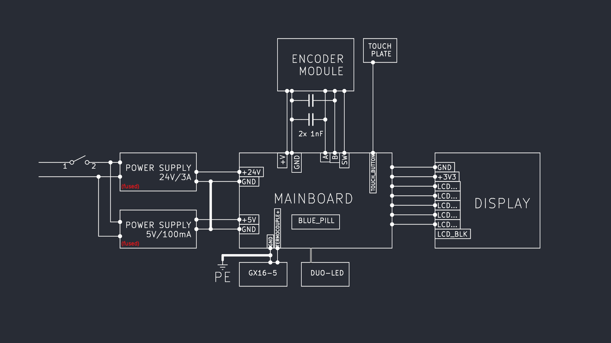

# Stacja lutownicza T12

<table>
    <td></td>
    <td></td>
</table>

## Specyfikacja:
- **Czas nagrzewania**: 5 sekund do osiągnięcia 200°C
- **Dokładność pomiaru**: do ±5%
- **Moc**: 75W
- **Niestabilność (stałość) ustawionej temperatury**: ±0.2°C
- **Zakres temperatur**: 0 – 500°C (od temperatury pokojowej)
- **Liczba próbek ADC**: 250
- **Czas pomiaru** / **Procentowy czas pomiaru (wyłączanie grzania)**: 1.4ms / 1.4% (lub 0.9ms / 0.9% dla temperatur >150°C)
- **Częstotliwość PWM** / **Częstotliwość pomiaru**: 50Hz / 10Hz
- **Inne**: (cechy poniżej)


<!-- # O mojej motywacji

elektroda. 
*Tłumaczone strony z polskiego! -->

### Cechy:

- Kompatybilność z grotami T12
- Wyświetlacz IPS
    - Bieżąca i ustawiona temperatura w `°C`
    - Wskaźnik paska wyjścia mocy
    - Ustawienia (PID i GUI)
- Enkoder obrotowy
- Przycisk dotykowy (zatrzymaj/uruchom grzanie)
- Dioda LED grzania
- Przełącznik 230VAC 
- Panel przedni - wykonany z PCB
- Złącze GX16 (łatwa wymiana kolby/grotów)

#### Cechy oprogramowania:

- Efektywne ustawianie temperatury - kontroler PID
- Pamięć - Eeprom
- Autosleep (todo)

## Schematy

<table>
    <tr></tr>
    <tr>
        <td></td>
    </tr>
</table>

## Wymagania oprogramowania

[stlink](https://github.com/stlink-org/stlink?tab=readme-ov-file), kicad (opcjonalnie)

## Programowanie

Do wgrania binarki na STM32 wymagany jest debugger. Klon STLINK-V2 jest ok.

``` bash
st-flash --reset write soldering-*.bin 0x08000000
```

Jeśli pojawi się błąd, to prawdopodobnie masz klona STM32. Nic złego. Płytki Blue-Pill często mają klony. Sprawdź `st-info --chipid`. Dla klonów "chipid" wynosi 0 zamiast np. 0x0410. Spróbuj wgrać z moim plikiem konfiguracyjnym.

``` bash
st-flash -c doc/BP_clone.cfg --reset write soldering-*.bin 0x08000000
```

## Instrukcja montażu

1. Na początek zapoznaj się z listą materiałów (BOM) znajdującą się poniżej. Następnie sprawdź [PCB BOM online][podglad-bom-v1] lub jako plik w `PCB/{wersja}/bom/ibom.html`. (Sugeruję pobranie repozytorium w tym punkcie)

    |||
    |-|-|
    |Elementy PCB| wszystkie istotne komponenty z listy materiałów PCB
    |Zasilacz 24V| 24V/3A lub większy prąd (np. 24V/4A) |
    |Zasilacz 5V| 5V/100mA lub większy prąd |
    |MCU| Płytka Blue Pill|
    |Wyświetlacz| Moduł ST7735 SPI 160x80 0.96"|
    |Enkoder| Moduł enkodera obrotowego|
    |Gniazdo lutownicze| Gniazdo GX16-5|
    |Panel przedni| Front Panel PCB (projekt w folderze repozytorium)|
    |Pokrętło| Pokrętło do enkodera|
    |Przełącznik AC| SPDT|
    |Pozostałe elementy| LED lub dioda dwukolorowa 3mm, 2x 1nF THT|

    Upewnij się, że masz wszystko, czego potrzebujesz do samodzielnego wykonania. Dobrze jest sprawdzić, czy wszystkie części działają przed rozpoczęciem montażu.
2. Jeśli wykonujesz PCB samodzielnie, pamiętaj o:
    <!-- - Możesz użyć _Ready-to-print.pdf_ np. do metody żelazkowej -->
    - Zabezpiecz miedź np. kalafonią
    - Przylutuj przewody z warstwy "F.cu" (może być przed wierceniem, z wyjątkiem dwóch połączeń)
        


    Jeśli zamawiasz PCB, pamiętaj, że możesz zamówić panel przedni z PCB razem.

3. Lutowanie elementów SMD (**po wierceniu**) - Lista materiałów [online][podglad-bom-v1] lub `PCB/*/bom/` może pomóc
4. Lutowanie THT
5. Zamocuj zasilacz 24V do obudowy urządzenia i **wykonaj izolację** między PCB (Zplanuj tę obudowę od wewnątrz - wystające pypki)
6. Wykonaj przewody zasilające z ogólnego schematu dla: _Przełącznik, Zasilacze, Gniazdo AC_ (**Zaizoluj przewody 230V i złącza**)
7. Wykonaj i przylutuj przewody z ogólnego schematu (dla: _Wyświetlacz, Enkoder, itp._) i dodaj 2x 1nF do modułu enkodera, jeśli nie ma on kondensatorów
6. **Zaizoluj** i Zamocuj (przyklej) zasilacz 5V
7. Połącz wszystko ze sobą, wgraj binarkę i **sprawdź, czy działa**
8. Przyklej OLED jak urządzenie działa (będzie łatwiej dopasować) do (jeśli masz) front panelu PCB.
9. Teraz złóż wszystko do kupy

### Dodatkowe wskazówki dotyczące montażu

- **Bądź ostrożny** z **Zasilaniem AC**

- wymagane narzędzia:
    - działająca lutownica (to zabawne, ale nie ironiczne)
    - trochę kleju (np. gorącego kleju lub b7000)
    - wiertarka, wiertła: ~3mm, 0,7mm, 0,9mm (zobacz w kicad brd)
    - pęseta
    - (opcjonalnie) narzędzie do zaciskania złączek Dupont

- dobrze mieć:
    - złącza przewodów żeńskie Dupont + kątowe złącza kołkowe 2.54mm

- Panel przedni

    Musisz zamówić PCB lub wyercić otwory na CNC. Alternatywnie spróbuj wydrukować 'cut edges' na papierze i wyciąć płytę z tworzywa sztucznego za pomocą noża / wiertarki. Obudowy G762 mają dość miękkie plastiki (prawdopodobnie ABS) - frontowe/tylne płytki.

## Galeria


Sprawdź folder `Pictures/`! :)

---

#### Wyobrażona koncepcja:

Co zdecydowałem pozostawić na etapie koncepcji:

- Kompatybilność z kolbą 907
- Rozpoznawanie końcówek
- Pomiar termistora zimnego złącza termopary
- Opcjonalne zasilanie li-ion

### Współpraca

Zapraszam do otwierania Pull Requestów lub zgłaszania problemów 'Issue'

---

<a rel="license" href="https://creativecommons.org/licenses/by-nc/4.0"></a>

[podglad-bom-v1]: https://html-preview.github.io/?url=https://github.com/szymonPJO/SolderingStation-T12/blob/main/PCB/soldering-mainboard-v1.0/bom/ibom.html